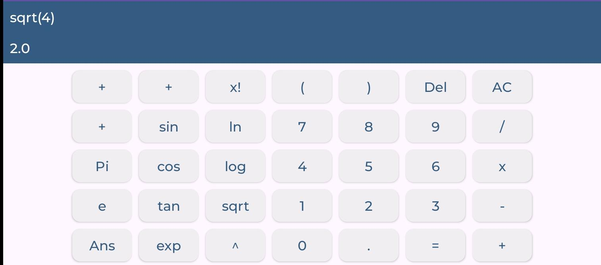
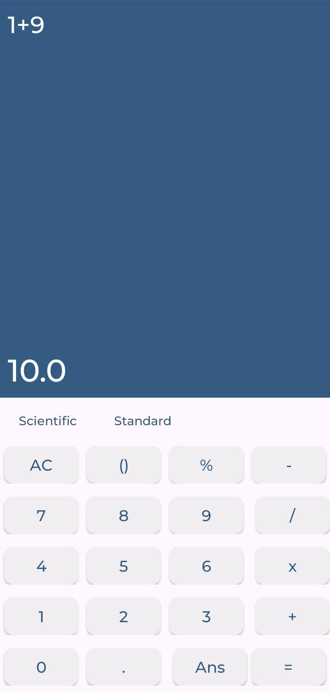

# Scientific Calculator


This is a scientific calculator application developed in Java and Kotlin, using Gradle as a build tool. The calculator is capable of performing a variety of mathematical operations.

## Features

- Basic arithmetic operations: addition, subtraction, multiplication, and division.
- Mathematical functions: exponentiation (`exp`), square root (`sqrt`), power (`pow`), natural logarithm (`log`), sine (`sin`), cosine (`cos`), and tangent (`tan`).

## Screenshots



## Testing

The project includes a set of parameterized unit tests in the `ExampleInstrumentedTest` class. These tests use various mathematical expressions and their expected results as input data, ensuring the correctness of the calculator's operations.

## Usage

To use the calculator, simply input your mathematical expression as a string. For example:

```java
double result = Calculator.evaluate("2 + 2");
```
This will return the result of the expression, in this case 4.0.
